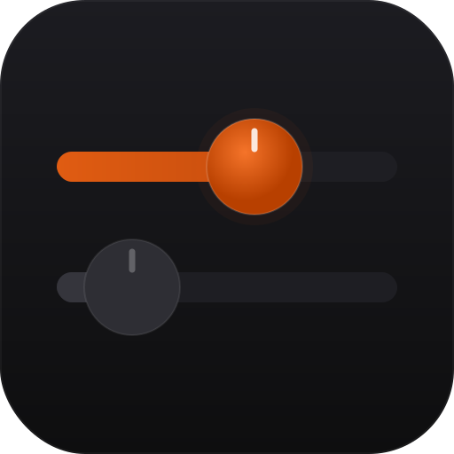
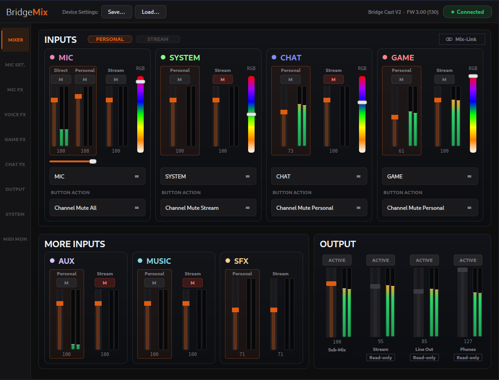
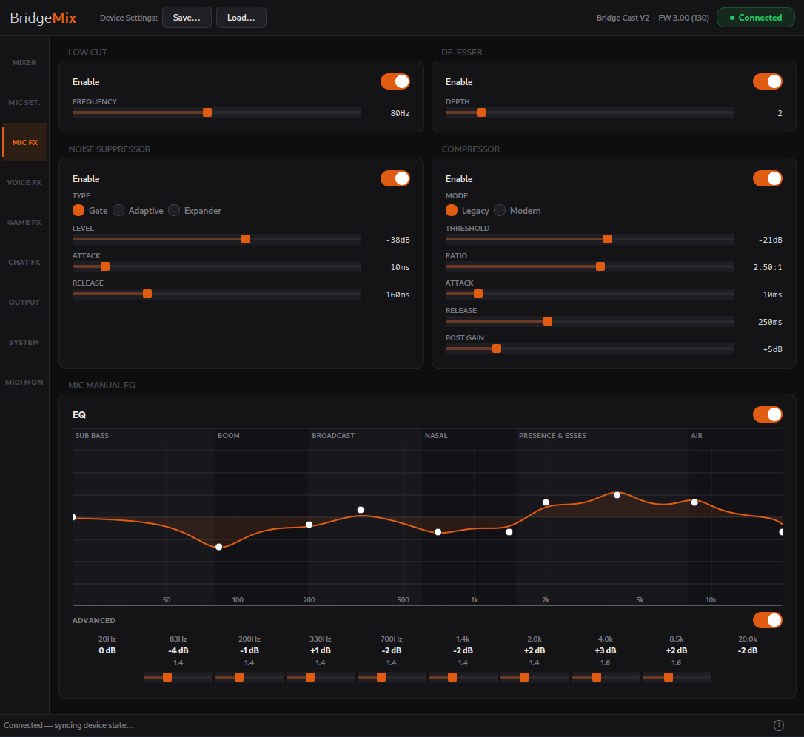
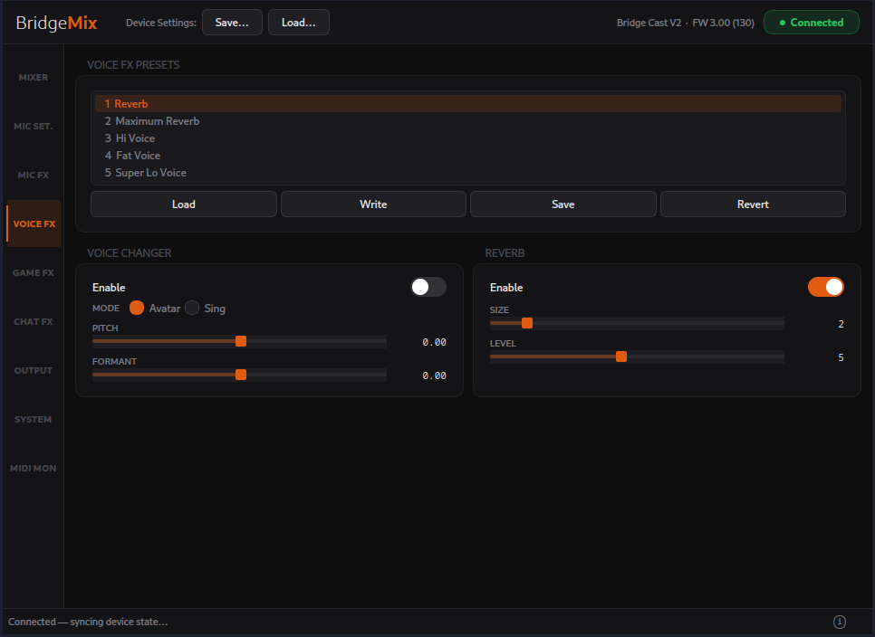
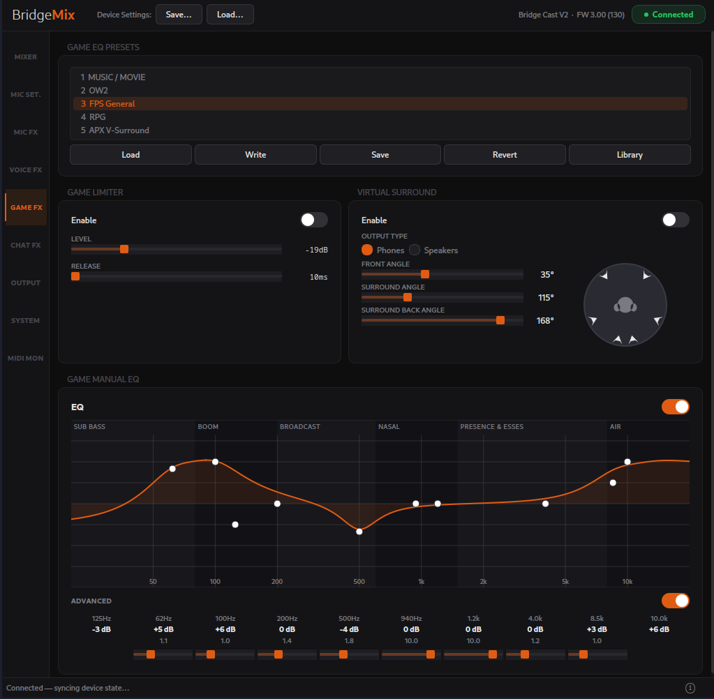
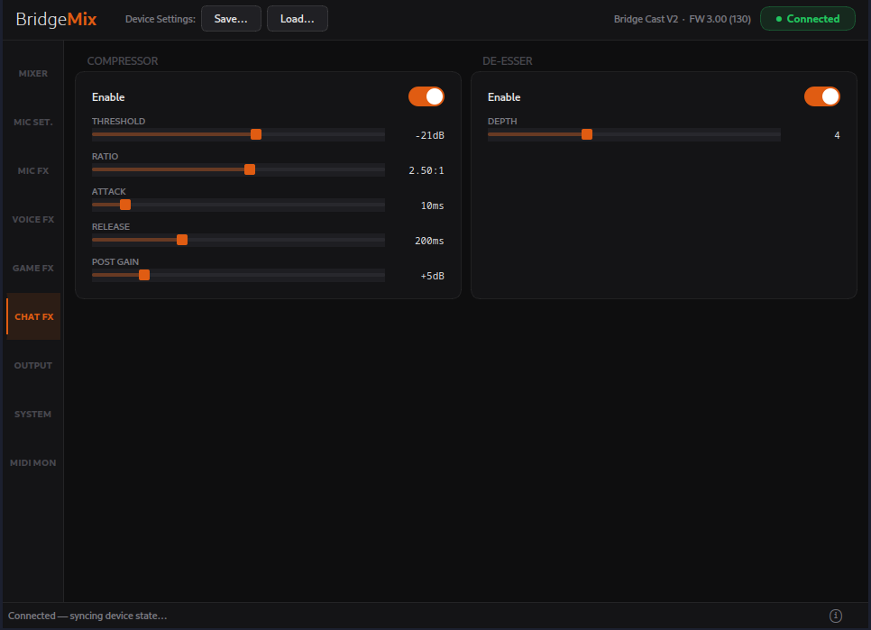
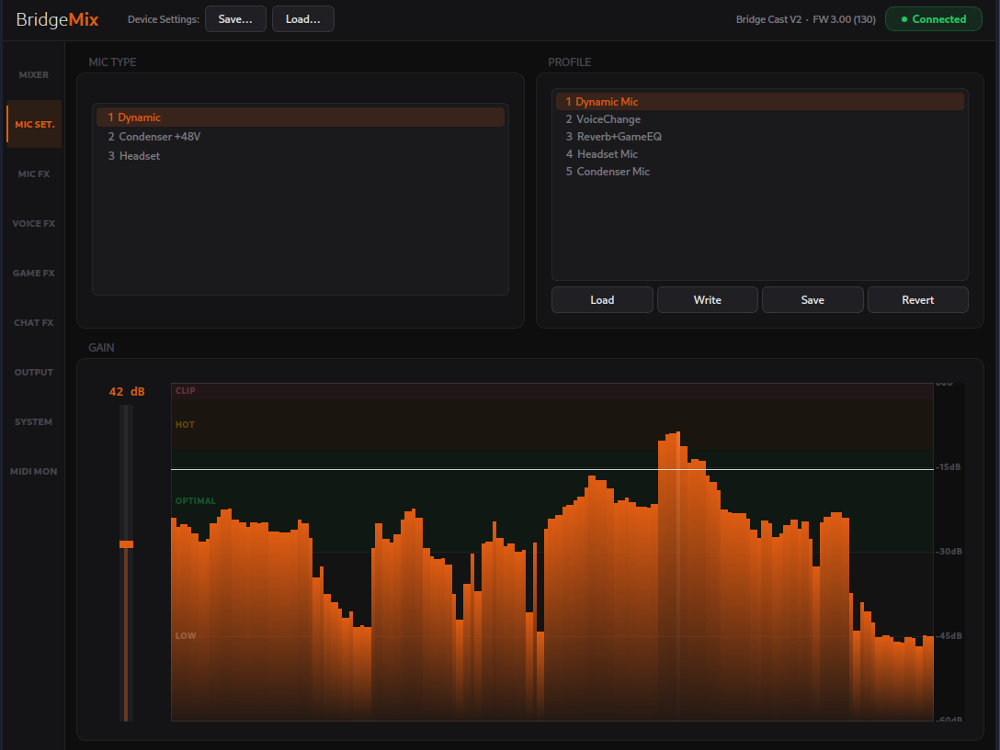
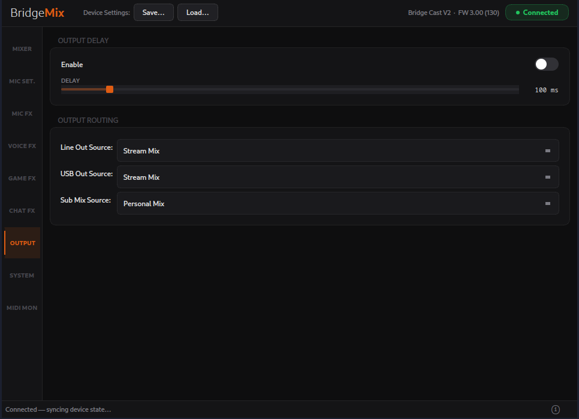
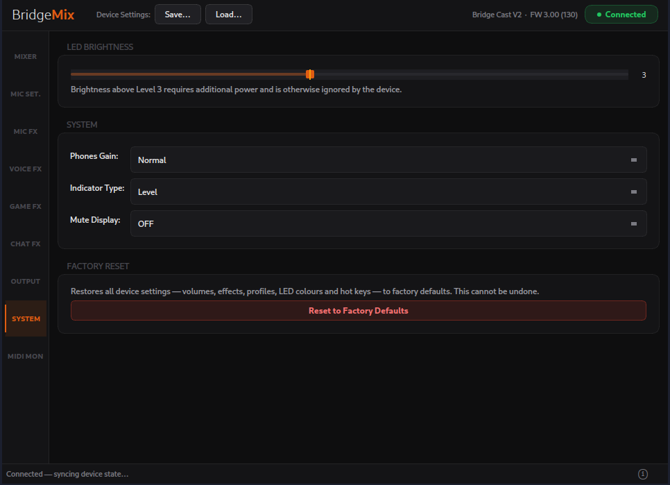
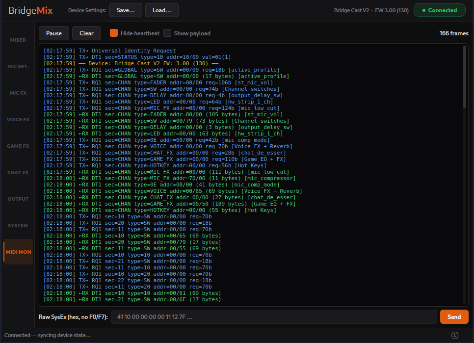

<div align="center">



# BridgeMix

**A sleek, unofficial Linux controller for the Roland BRIDGE CAST audio mixer.**

[](LICENSE)




</div>

---
> **Notice on AI:** Parts of this project were developed with AI assistance. 
> The code has been reviewed and curated by the maintainer, but you may encounter rough edges. Bug reports are welcome.


## About

The official Roland companion app is Windows/macOS only. **BridgeMix** brings full
control of the Bridge Cast to Linux — mixes, mic FX, voice changer, game FX, output
routing, profiles and live metering — by speaking the device's MIDI SysEx protocol.
No custom driver needed: the Bridge Cast is USB-Audio-class compliant.

## Features

| Area | Highlights |
|---|---|
| **Mixer** | Stream + Personal buses · all 7 channels (volume + mute) · Mix Mode · Mix Link · live level meters |
| **Outputs** | Sub-Mix volume · output mutes (Stream / Sub-Mix / Phones / Line) · Output Delay · Line / USB / Sub-Mix modes |
| **Profiles** | 5 slots — select, rename, save |
| **Mic input** | Source (XLR / headset) · +48 V phantom · gain |
| **Mic FX** | Low Cut · Noise Suppressor (Gate / Adaptive / Expander) · De-esser · Compressor (Legacy + Modern LA-2A) · 10-band EQ **with live spectrum analyzer** |
| **Voice FX** | Pitch · Formant · Avatar / Sing · Reverb · 5 preset slots |
| **Game FX** | 10-band EQ · Limiter · Virtual Surround · 5 preset slots |
| **Chat FX** | De-esser · Compressor |
| **Hardware** | Strip channel assignment · strip button actions · LED ring colours · HOT KEY button 1 |
| **System** | LED brightness · phones gain · indicator type · mute display · SFX A/B volume |
| **Tools** | Device auto-detect · JSON preset save / load · live MIDI monitor |

### Not implemented yet

| Feature | Why |
|---|---|
| Game EQ spectrum analyzer | The host-side SUB MIX capture is unresolved on Linux — the **Mic EQ** analyzer ships and works |
| HOT KEY buttons 2–4 · SFX A/B trigger · Beep | SysEx addresses not yet mapped |
| Voice Transformer extras (Robot, Megaphone, consonant mode) | Stored in preset banks; live addresses unknown |
| Some fine Mic-FX params (NS Adaptive attack/release, a few LA-2A controls) | Addresses not yet captured |
| Per-strip LED on/off · per-preset LED colours | Write path unknown |
| BGM · HDMI controls (Bridge Cast X)  | Out of current scope |
| Firmware update | Intentionally **not** supported (too risky) |

## Screenshots

<details>
<summary><b>Show the rest of the app</b></summary>

<br/>

| Mic FX | Voice FX |
|:---:|:---:|
|  |  |
| **Game FX** | **Chat FX** |
|  |  |
| **Mic Setup** | **Output** |
|  |  |
| **System** | **MIDI Monitor** |
|  |  |

</details>

## Install & Run
This software was developed on an original Roland Brige Cast. The compatibility to the Bridge Cast X and BridgeCast ONE is not guaranteed.
**Requirements**

- **Linux** — or **Windows** (the app runs there too)
- A **Roland Bridge Cast** (original, V2) on **FW 3.00 (115)**
- **Python 3.11+**, or conda

```bash
git clone https://github.com/Ex0danify/BridgeMix.git
cd BridgeMix
./setup.sh
```

*(On Windows the `setup.sh` menu doesn't apply — install with `pip install -e .`, then run `python -m bridgemix`.)*

Run from a terminal, `setup.sh` shows a friendly keyboard menu (↑/↓, **Enter**):

| Option | What it does |
|---|---|
| **Install & Launch** | Sets things up, adds BridgeMix to your applications menu, and starts it |
| **Launch** | Starts BridgeMix without adding a menu entry |
| **Uninstall** | Removes the applications-menu entry |

Prefer flags? `./setup.sh --install` · `--launch` · `--uninstall`.

It sets itself up automatically — a `bridgemix` conda env if you have conda, otherwise
a self-contained Python venv (`.venv`). The first run downloads dependencies (about a
minute); after that it's instant. Force a backend with `BRIDGEMIX_BACKEND=conda|venv`.

> **New to Linux?** If your file manager asks what to do with `setup.sh`, choose
> **“Run in Terminal”** to see the menu. Once installed, just launch BridgeMix from your
> applications menu like any other app.

## Using it

1. Connect the Bridge Cast over USB.
2. Open BridgeMix and click **Connect** — it auto-detects the MIDI ports.
3. Tweak away; everything applies to the device live.

## Disclaimer

**BridgeMix is an independent, unofficial project.** It is **not affiliated with,
authorized, maintained, sponsored, or endorsed by Roland Corporation**, or any of
its subsidiaries or affiliates. "Roland" and "BRIDGE CAST" are trademarks of
Roland Corporation, used here solely to identify the hardware this software
interoperates with. The control protocol was determined through independent
observation.

The software is provided **"as is", without warranty of any kind**, express or
implied (see the [LICENSE](LICENSE) for the full terms). Behaviour described here
may not work on every platform, operating system, or device/firmware
configuration. Interacting with your audio hardware is **at your own risk.**


## License

BridgeMix is licensed under the **GNU General Public License v3.0 or later**
(GPL-3.0-or-later). See [LICENSE](LICENSE).
